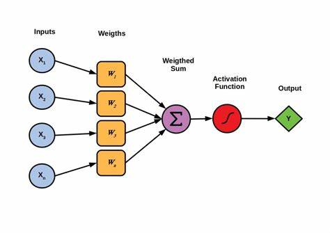
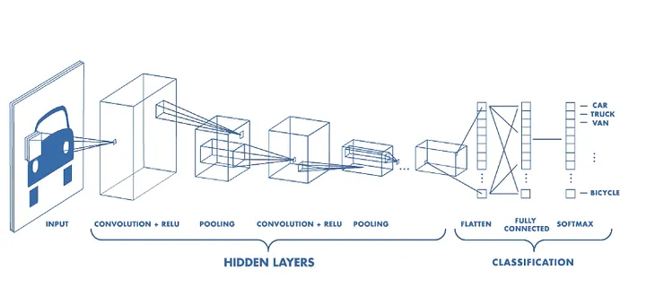

# Deep Learning 

Deep learning is application of multi-layered neural networks (deep neural networks). This is based on the idea of trying to simulate the structure of the human brain (in a very abstract way) by creating interconnected neurons arranged as virtual layers inside of a computer. Deep neural networks operate on principles of mathematical and statistical optimization rather than truly mimicking brain functions.​​

Each neuron in layer receives input, processes it and then passes it into the neurons in the next layer. These multi-layer networks can train on datasets that enable them to learn complex patterns and relationships. Neural networks can be applied to many different situations such as regression, classification and famously part of generative AI such as ChatGPT.​​

To better understand how neural networks work we will look at a perceptron which is a classic example of a single neuron, how these fit into a wider neural network and how learning takes place during the training process.

## Perceptron

This perceptron consists of inputs, weights, bias (which is added to the weighted sum),  an activation function and an output.

​

* Inputs - If the neuron is in the first layer, the inputs would consist of the input data. In most cases this is the feature vector of an instance (predictor values) from our dataset. If the neuron is in any other layer, the inputs are the outputs of neurons from the preceding layer.​​

* Weights - Each input is paired with a weight. These weights are how a neuron learns during training , they are modified and fine-tuned over time. Each input is multiplied with its corresponding weight and then the results are summed together before being passed onto the activation function (this number is called a weighted sum).

* Activation Function - Activation functions are pivotal in neural networks, determining whether a neuron should be activated based on the weighted sum of its inputs. These functions can vary, chosen based on the specific application and characteristics desired in the model. A common example is the sigmoid function, which maps any input value to a range between 0 and 1, making it useful for models where the output is probabilistic or binary. ​

* Bias - is a critically important element of the perceptron and is altered during training. The bias is a single number that is added to the weighted sum before it is passed to the activation function. It acts as a modifier to the threshold of the activation function, effectively moving the function to the left or right on the x-axis, allowing the function to be optimized to the task at hand.

## Neural Network

Neural networks consist of layered neurons, such as perceptron's. The input layer receives the data, with each neuron assigned different weights and biases. Typically, all neurons in a layer share the same activation function.

Hidden layers connect the input to the output layer, processing the prior layer's neuron outputs. A fully connected network, where each neuron receives outputs from all neurons in the previous layer, is common but not universal.

The output layer's activation function depends on the task: a sigmoid function might output probabilities for classification, while a linear function could directly output values for regression.

Learning occurs through operations like backpropagation, where after a prediction (forward pass), the network adjusts its weights and biases based on the prediction error, often measured by mean squared error (MSE). These adjustments can be made per prediction (online learning) or in batches.

Here is a approachable video of how backpropagation works, allowing these networks to 'learn' by correcting their internal weights - [Backpropagation](https://www.youtube.com/watch?v=Ilg3gGewQ5U)

Training involves multiple epochs, where one epoch represents one full pass through the dataset. The scale of the network, volume of data, and extent of weight updates contribute to the computational intensity of neural network training. The limits of training scale are set by the quality of data, computational resources, and time available.

A great video explanation of a neural network - [Hand written digit classifier](https://www.youtube.com/watch?v=aircAruvnKk)

## Generative AI

Generative AI is a sophisticated application of deep learning that extends beyond data analysis to data creation. At its core, it involves training neural networks to replicate and generate patterns found within a dataset. A prime example of generative AI in action is ChatGPT, which is trained on a diverse dataset comprising vast amounts of text from the internet.

The training of ChatGPT utilizes a type of neural network called a Transformer. This network architecture is adept at handling sequences, making it particularly suitable for processing and generating text.

A handy video walkthrough of a transformer - [Transformer explanation](https://www.youtube.com/watch?v=wjZofJX0v4M)

When ChatGPT processes input text, it breaks it down into 'tokens'. These tokens are then converted into vectors in a multi-dimensional space using a 'word embedding table' that has been trained to keep 'similar' words close to one another. An 'attention mechanism' then weighs the importance of words in context, allowing the model to focus on the relevant parts of the text.

ChatGPT needs to be trained to perform these tasks effectively. During its training phase, ChatGPT is presented with text sequences and learns to predict subsequent words based on the preceding context. This learning process resembles a sophisticated form of pattern recognition, where the model learns the likelihood of word sequences. It is a form of 'Self-Supervised Learning'. For example, given the text "The cat sat on the...", the model predicts the next word ("mat") using the preceding text as context. The "label" in this case is the next word in the sequence, which is derived from the text itself, rather than being an external annotation.

A unique aspect of ChatGPT's training involves the integration of human feedback. Human labelers play a crucial role by evaluating the generated text for relevance, coherence, and accuracy. This feedback is used to fine-tune the model through a process known as Reinforcement Learning from Human Feedback (RLHF). This process guides the model towards generating responses that not only make logical sense but also align more closely with human expectations and nuances in language use.

This iterative training, coupled with feedback from human evaluators, contributes to ChatGPT's development in producing text. The involvement of human labelers in the training of GPT models provides an additional layer of refinement, aiming to improve the model's understanding of human-like text generation. 

However, while this approach seeks to enhance the model's ability to produce text that may seem coherent and contextually relevant, it's important to acknowledge the inherent challenges and limitations in fully capturing the nuances of human communication through AI. The quality of output can vary, and the model may still generate nonsensical or irrelevant text, especially when dealing with complex topics or nuanced prompts.

It's crucial to understand that generative AI, like ChatGPT operate on a statistical basis, analyzing patterns in the data it has been trained on to generate new content. This means that while chatGPT can produce text that is often plausible and reads as if it were written by a human, it is not inherently factual or rigorous. ​​

The model makes predictions based on the likelihood of word sequences without an understanding of truth or the ability to verify the accuracy of the information it generates. This statistical approach to generating text underscores the importance of treating generative AI's output with scrutiny, especially in contexts where factual accuracy and reliability are paramount.

This is not all, though. What about those smart-looking picture makers? DALL-E, Midjourney, Stable Diffusion, Leonardo.AI, Ideogram, and so on? Actually, the way they work is fairly similar to what we’ve just described, with some wrinkles.

The text prompt that you put in is broken up into tokens—but instead of mapping to text, the tokens are mapped into a vector space that represents encoded images. This information is then used by an image decoder to build your image.

With all of the above, I’ve skipped over something very important. Training. For example, with DALL-E, we need to train our model so that it correctly links a picture of (say) the token corresponding to ‘hippopotamus’ with pictures of hippopotami. This is done by comparing the image to N pictures accurately labeled to represent a hippo—and N2 pictures of “not-hippos” for reference purposes. This is a general theme with these AI models. They are hungry for large amounts of information. They are correspondingly energy hungry. Think ‘climate change’.

When you meet the term generative AI, this refers to ‘AI’ based on the above approach. The same principles can be used to generate text, computer code, images, music, and even videos.

## Computer Vision

Computer vision is perhaps the most exciting area of AI from a clinical perspective. Visual data lends itself very well to being processed by neural networks, particularly those utilizing convolutions. A convolution is a mathematical operation that applies a filter (or kernel) to an image. This filter slides over the image, performing a dot product between the filter and the local regions of the image, which highlights specific features such as edges, textures, or patterns. These extracted features are often imperceptible to a human viewing the original image.

By stacking multiple layers of convolutions, neural networks can build a hierarchy of features, allowing them to recognize complex structures within the image. This process enables the network to progressively learn more abstract and high-level representations of the visual data.

In practical applications, convolutional neural networks (CNNs) have many actives applications in the field of radiology. For example, they are being actively researched and applied in areas such as fracture detection, CT interpretation, and the diagnosis of diabetic retinopathy. The ability of CNNs to process and analyze visual data with high accuracy holds great promise for improving diagnostic processes and patient outcomes in the medical field.

A video based breakdown on how those convolutions works - [Convolutions](https://www.youtube.com/watch?v=KuXjwB4LzSA)

Computer vision systems trained using deep learning techniques can assist clinicians by providing preliminary analysis and highlighting areas of interest in medical images, thus enhancing the efficiency and accuracy of diagnoses.

## Further Learning

Gradient descent is a crucially important concept, and method that neural networks and other machine learning algorithms use to minimize their errors during training - [Gradient Descent](https://www.youtube.com/watch?v=IHZwWFHWa-w)

As impressive as large models have been in recent memory, state-of-the art applications for AI systems are increasingly heading towards compound AI systems comprised of multiple components working together instead of single large models:

* [Compund AI Systems](https://bair.berkeley.edu/blog/2024/02/18/compound-ai-systems/)

* [Large language model abstractions](https://www.twosigma.com/articles/a-guide-to-large-language-model-abstractions/)
