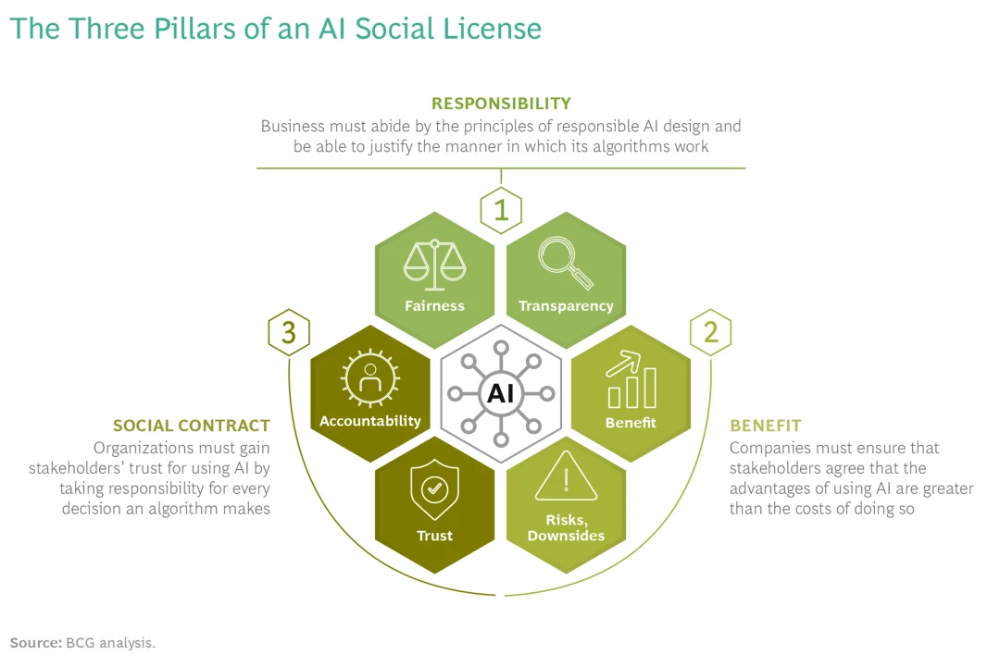

# Social license, Governance and Ethics

## Social License

The term social licensing refers to societal acceptance earned through reliable and ethical practices.  In reference to AI, it’s the difference between possessing the legal right to use AI and earning societal acceptance to use AI. Social licenses are won not bought.

Healthcare systems worldwide face immense pressure to achieve the quadruple aim: improving population health, enhancing patients' experiences of care, boosting caregiver satisfaction, and reducing the rising costs of care. AI has emerged as a transformative tool with the potential to revolutionize healthcare. However, for AI to be effective, the public must trust that AI algorithms are accountable, fair, and transparent. The current approach often emphasizes identifying healthcare problems and applying AI solutions without fully considering clinical workflows, user needs, trust, safety, and ethical implications.

Historical AI failures highlight the importance of responsible AI use and the need for a social license. Microsoft's TayTweets, an AI chatbot, quickly turned into a PR disaster due to its inability to handle malicious inputs, resulting in racist and offensive outputs. Amazon's AI hiring tool, intended to streamline recruitment, was found to be biased against women because it was trained on historical data predominantly featuring male candidates. These examples underscore the necessity of designing AI systems with ethical considerations and robust oversight to prevent such failures.

Modern AI is a relatively new discipline, and public understanding of its functions is limited. It is crucial to demystify AI and its role in healthcare, demonstrating its benefits, justifying its use in projects, and ensuring data protection. Effective data governance is the foundation for building trust and accountability in using AI in healthcare. Clear and transparent data governance practices reassure the public that their data is being handled responsibly and ethically, which is essential for gaining a social license.

To implement AI effectively in healthcare, there needs to be a clear demonstration of responsible AI practices. Companies must be transparent about their algorithms' workings and outcomes, ensuring that AI applications are perceived as fair and transparent. AI systems must be designed to avoid demographic biases and provide consistent and equitable results. Additionally, businesses must communicate the benefits and potential downsides of AI openly, educating all stakeholders about the technology's implications.

Gaining a social license for AI in healthcare involves more than just meeting regulatory requirements. It requires ongoing dialogue with stakeholders, including patients, healthcare providers, and the public, to address their concerns and expectations. Companies must prioritize human oversight, develop mechanisms to handle exceptions, and be transparent about AI's decision-making processes. By doing so, they can earn the trust and acceptance needed to integrate AI into healthcare systems effectively.

In conclusion, achieving a social license for AI in healthcare is crucial for its successful implementation. By ensuring responsible AI practices, transparent data governance, and ongoing stakeholder engagement, healthcare systems can harness the transformative potential of AI while maintaining public trust and confidence.

## Data Governance

Data governance is the structured process of managing the availability, usability, integrity, and security of data within government and enterprise systems. It involves setting internal standards and policies to control data usage, ensuring data consistency, and preventing misuse. Effective data governance is crucial for organizations to comply with expanding data privacy regulations and to optimize operations through reliable data analytics, driving informed business decision-making. In healthcare, this means ensuring that patient data is accurate, secure, and accessible for improving patient care and operational efficiency.

Without effective data governance, inconsistencies in patient data across different systems can lead to operational challenges, affecting the accuracy of business intelligence, reporting, and data-driven decision-making in healthcare. Poor data governance can also hinder compliance with data privacy laws, posing risks to patient confidentiality and organizational integrity. For healthcare organizations, robust data governance is essential to ensure data integrity, protect patient privacy, and maintain trust.

Modern AI is a relatively new discipline, and social understanding of its function is limited. It's important to demystify the term AI and its role in healthcare moving forward, to demonstrate its benefits, justify its existence within projects and communicate how data will be protected. 

For the healthcare system to implement AI functions into their day-to-day operations, there needs to be a clear demonstration that good data governance practices are in place. ​Effective data governance is the foundation of forging a relationship of trust and accountability around the use of AI in healthcare.

## NZ's data & information management principles 

* Open: Data held by the New Zealand government needs to be open to the public.​

* Protected: Personal, confidential and classified data is protected​​.

* Readily available: Open data and information is released proactively. Data is discoverable and accessible​.​

* Trusted  & authoritative: Data collected supports the purpose for which it was collected. 

* Well managed: Data held/ owned by the government belongs to the NZ public. Should only be collected/ generated for specified purposes​.​

* Reasonability priced: Use and re-use of government held data is expected to be free​.​

* Reuseable: data and information released can be discovered, shared and reused over time and through technology changes.

## Ethical Considerations of AI in healthcare

There are 3 key ethical consideration for the use of AI in healthcare​:
 
Privacy and data protections: ​Utilizing AI in healthcare involves the collection, storage and analysis of sensitive health data (e.g., patient records) and AI analysis of such data accompanies inherent risks. The ethical dilemma is posed around how to balance the privacy of patients and the accuracy of the AI. How much private health information can be programed into an AI algorithm and how is this data going to be protected? 

Ensuring that health information used in AI systems is protected requires all actors involved in its development and implementation to understand the risks associated with its use, how to mitigate those risks how to legislate its use appropriately. 

Informed consent and autonomy: There needs to be "transparent and understandable" disclosure to patients surrounding how their information is being use and stored.Concerns arise when discussing how the use of AI in patient care interacts with the patients right to informed consent.To what extent do clinicians have to educate patient on the AI algorithms used to reach a particular decisions or diagnoses? Are clinicians themselves educated enough to explain this adequately?

Another area of concern is the use of Blackbox algorithms, referring to when AI developers show the outputs of their algorithms but not their internal workings to protect their intellectual property.  Using Blackbox algorithms in healthcare would violate patients right to informed consent as explanations for how decisions were reached or how personal information was used would not be provided
​
Algorithmic bias and discrimination: Any machine learning algorithm is only as trustworthy as the data is it trained on. An important ethical consideration for AI's use in the healthcare systems is that the algorithm's training data does not reflect the racial and gender-based discrimination presented in society.

Marginalised communities' historical exclusion from research and statistics has led to these groups being underrepresented in the algorithms training data. This can exacerbate existing stereotypes if not appropriately accounted for. Using bias data to train AI algorithms will promote further discrimination within the healthcare system.

## Māori Data Sovereignty & Principles of Māori Data Sovereignty

Māori Data Sovereignty refers to the inherent rights and interests that Māori have in relation to the collection, ownership, and application of Māori data. It encompasses the principles, structures, accountability mechanisms, legal instruments, and policies through which Māori exercise control over their data. This concept is vital for the protection and promotion of Māori rights and interests, ensuring that data is used ethically and in ways that enhance the wellbeing of Māori people, language, and culture.

Māori Data Sovereignty is crucial to New Zealand as it acknowledges and respects the unique relationship between Māori and their data. This relationship is rooted in the broader context of Māori rights as Indigenous peoples, including their connections to land, water, and the natural world. Recognized by Te Tiriti o Waitangi (The Treaty of Waitangi) and the United Nations Declaration on the Rights of Indigenous Peoples (UNDRIP), these rights emphasize the need for Māori to have authority over their data. This governance ensures that data practices support Māori self-determination, cultural preservation, and community wellbeing, contributing to the overall equity and justice within New Zealand society.

**Rangatiratanga | Authority**

1.1 **Control**: Māori have the inherent right to control their data and data ecosystems, including creation, collection, access, analysis, interpretation, management, security, dissemination, use, and reuse.

1.2 **Jurisdiction**: Decisions about the storage of Māori data should enhance control for current and future generations, preferably keeping data within Aotearoa New Zealand.

1.3 **Self-determination**: Māori have the right to data that empowers sustainable self-determination and effective self-governance.

**Whakapapa | Relationships**

2.1 **Context**: All data has a whakapapa (genealogy). Metadata should provide information about the data's provenance, collection purposes, context, and involved parties.

2.2 **Data disaggregation**: Disaggregating Māori data increases its relevance for Māori communities and iwi, using categories that prioritize Māori needs and aspirations.

2.3 **Future use**: Decisions made today about data can have long-term consequences for future generations of Māori, emphasizing the need for protective data governance.

**Whanaungatanga | Obligations**

3.1 **Balancing rights**: Individual rights, including privacy, must be balanced with group rights. In some cases, collective Māori rights will prevail over individual rights.

3.2 **Accountabilities**: Those responsible for Māori data are accountable to the communities, groups, and individuals from whom the data derives.

**Kotahitanga | Collective benefit**

4.1 **Benefit**: Data ecosystems should enable Māori to derive individual and collective benefits.

4.2 **Build capacity**: Developing a Māori workforce is essential for the creation, collection, management, security, governance, and application of data.

4.3 **Connect**: Supporting connections between Māori and other Indigenous peoples to share strategies, resources, and ideas related to data.

**Manaakitanga | Reciprocity**

5.1 **Respect**: Data collection, use, and interpretation should uphold the dignity of Māori communities, avoiding analysis that stigmatizes or blames Māori.

5.2 **Consent**: Free, prior, and informed consent (FPIC) should underpin the collection and use of Māori data, balanced by robust governance arrangements.

**Kaitiakitanga | Guardianship**

6.1 **Guardianship**: Data storage and transfer should enable Māori to exercise kaitiakitanga (guardianship) over their data.

6.2 **Ethics**: Tikanga, kawa (protocols), and mātauranga (knowledge) should guide the protection, access, and use of Māori data.

6.3 **Restrictions**: Māori should decide which data is controlled (tapu) or open (noa) access.

## 2020 Privacy Act 13 Principles

The Privacy Act 2020 outlines 13 privacy principles that govern the collection, handling, and use of personal information. These principles are designed to protect individuals' privacy rights and ensure that organizations manage personal data responsibly and transparently.

1. **Purpose of Collection**:
      - Collect personal information only if it is for a lawful purpose and necessary for that purpose.
      - Avoid collecting unnecessary identifying information.

2. **Source of Information**:
      - Generally, collect personal information directly from the individual unless:
     - The person gives permission.
     - It would not prejudice the person's interests.
     - Direct collection would undermine the purpose.
     - Information is from a public source.

3. **Notification**:
     - Inform individuals about:
     - The reason for collection.
     - Who will receive it.
     - Whether it is compulsory or voluntary.
     - Consequences of not providing information.
     - Exceptions exist if notification undermines the collection purpose or is impossible.

4. **Manner of Collection**:
      - Collect information lawfully, fairly, and non-intrusively, especially from children and young people.

5. **Security Safeguards**:
      - Implement safeguards to prevent loss, misuse, or unauthorized disclosure of personal information.
      - Limit employee access to personal information.

6. **Access to Personal Information**:
      - Individuals have the right to access their personal information.
      - Access may be denied for safety, harassment, crime investigation, or privacy reasons.

7. **Correction of Information**:
      - Individuals can request corrections to their information.
      - Attach a statement of correction if the organization disagrees with the correction.

8. **Accuracy of Information**:
      - Ensure personal information is accurate, complete, relevant, up-to-date, and not misleading before use or disclosure.

9. **Retention of Information**:
      - Do not keep personal information longer than necessary.

10. **Use of Information**:
    - Use personal information only for the original purpose or directly related purposes.
    - Obtain permission for other uses or use in limited circumstances.

11. **Disclosure of Information**:
      - Disclose personal information only if:
      - It aligns with the purpose of collection.
      - Authorized by the person.
      - Used anonymously.
      - Necessary to avoid endangering health or safety.
      - Necessary for law maintenance.

12. **Overseas Transfer of Information**:
    - Ensure adequate protection before sending personal information overseas.
    - Obtain express permission if protections are inadequate, unless for law enforcement or safety purposes.

13. **Unique Identifiers**:
    - Use unique identifiers (e.g., IRD or driver’s license numbers) only if necessary for operational functions.
    - Avoid using the same identifier as other organizations.
    - Minimize the risk of misuse, such as identity theft.

