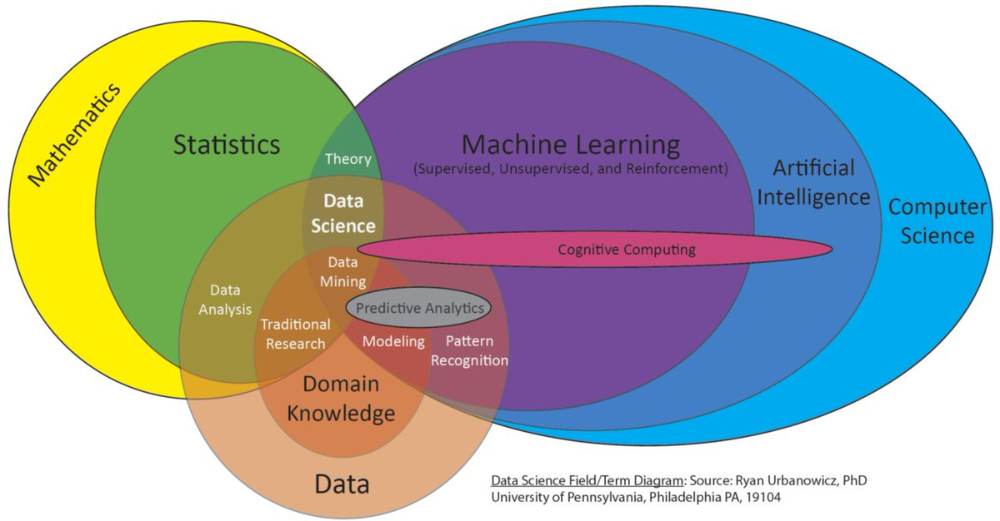
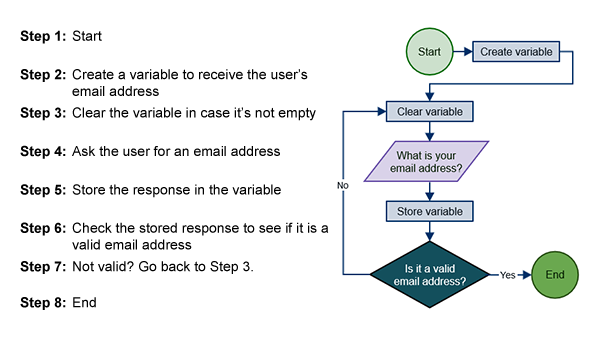
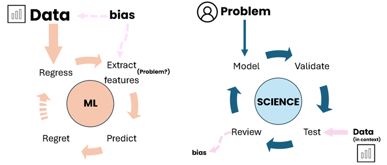

# AI 101, first steps on the learning journey!

Equip yourself with a general grasp of AI, machine learning, neural nets, and the questions we should have in mind as AI technology permates our daily live at an increasing pace.

What is AI ? That is one of those fun questions that has everyones favourite answer, it depends. 
AI can mean alot of different things to many people, it is a constantly evolving field and the way its spoken about is not always consistant. Before we stuck into the weeds of it all, we just want start of by clarifying a few terms and getting orientated around how things fit together.

## How things relate

The main terms you'll normally hear thrown around are: Algorithms, Artificial Intelligence, Machine Learning, Deep learning, Predictve AI and Generative AI.

First a good 'ol ven diagram on how the relavant fields of study surrounding AI technology:

The main thing to take from this diagram is that all of these concepts that we will talk about are nested within computer science, draw heavily on statistics and combine techniques from both to find new ways of leveraging the world of data for various purposes. 

Most of these 'techniques' are be lumped together with the umbrella term 'algorithm':

The term "algorithm" encompasses a broad range of analytical tools, from simpler regression models and decision trees used for predictions and streamlining processes, to more complex systems like neural networks and Bayesian models that utilize machine learning for advanced calculations and predictions, or just a simple set of instructions as depicted above. 

It's important to note that the risks and benefits of algorithms are not solely determined by their complexity. Even simple algorithms can have significant impacts, positive or negative, depending on their purpose and application. As such, focusing on the potential consequences and impact of algorithms is crucial, rather than solely on technical definitions or specific types.

Check out New Zealands algorithim charter for a great 3-pager:
[New Zealand's Algorithim Charter](https://data.govt.nz/assets/data-ethics/algorithm/Algorithm-Charter-2020_Final-English-1.pdf)

## What is the difference between AI and algorithims ?

While 'algorithm' can be used as a general label, when we talk about AI we generally mean something more precise.

The fundamental distinction between AI and traditional algorithms is that they are dynamic. They are not constrained to predetermined steps and boundaries and can cope with unforeseen situations. AI algorithms and systems can overtime, learn new strategies and rules to accomplish tasks.

Unlike traditional algorithms, which directly map out the steps to complete a task, AI algorithms focus on the methodology for learning or discovering the steps and rules necessary for task completion.

This capability underscores AI as the broader field of computer science dedicated to enabling computers to solve tasks autonomously, without direct human input.

## AI v Machine Learning

These two terms are often confused, conflated and interchanged. They are not the same things.

AI is the broad discipline aimed at enabling computers to solve tasks independently, whereas machine learning is its subset, focused on data-driven algorithms and techniques, equipping computers with the ability to learn and make data-informed decisions.

This field includes deep learning, which uses multi-layered neural networks for complex data analysis, computer vision, voice recognition, autonomous driving and large language models like ChatGPT through continuous learning. Machine learning drives other tasks such as inference for uncovering explainable relationships in data, and predictive classification for individual risk of disease. 

## Deep Learning

Is is the sub-domain where we find neural nets, generative AI, computer vision and popular tools like ChaptGPT. 

Deep learning is application of multi-layered neural networks (deep neural networks). This is based on the idea of trying to simulate the structure of the human brain (in a very abstract way) by creating interconnected neurons arranged as virtual layers inside of a computer. Deep neural networks operate on principles of mathematical and statistical optimization rather than truly mimicking brain functions.

Each neuron in layer receives input, processes it and then passes it into the neurons in the next layer. This carries on until the network produces an output, ('forward pass'). This output is compared to a target or desired result, the network can use the error between the two values to adjust it's layers in response and 'learn' ('back propagation'). These multi-layer networks can train on datasets that enable them to learn complex patterns and relationships. Neural networks can be applied to many different situations such as regression, classification and famously part of generative AI such as ChatGPT.

## Predictive AI

Is the more traditional application where past data is utilized to identify anomalies patterns and relationships using a network such as a recurrent neural net. These insights are then used to make predicitve analysis about what may occur in the future. 

## Computer Vision

Computer vision is perhaps the most exciting area of AI from a clinical perspective. Visual data lends itself very well to being processed by neural networks.  These kinds of neural networks utilize components called convolutions that enable them to extract out various characteristics of images, often imperceptible to a human viewing the original image by apply various kinds of filters. 

Applications in radiology such as fracture detection, CT interpretation and Diabetic retinopathy are just a few example of active areas where Computer Vision is being applied and researched. 

## Generative AI

Generative AI is a sophisticated application of deep learning that extends beyond data analysis to data creation. At its core, it involves training neural networks to replicate and innovate on the patterns found within a dataset. A prime example of generative AI in action is ChatGPT, which is trained on a diverse dataset comprising vast amounts of text from the internet.

It's crucial to understand that generative AI, like ChatGPT, operate on a statistical basis, analyzing patterns in the data it has been trained on to generate new content. This means that while it can produce text that is often plausible and reads as if it were written by a human, it is not inherently factual or rigorous. The model makes predictions based on the likelihood of word sequences without an understanding of truth or the ability to verify the accuracy of the information it generates.

## FAQ

**Can LLMs actually think?** 

No. Enthusiastic advocates like Sam Altman have said that AIs and people are all “stochastic parrots”, but this is incorrect. Current AIs merely work at the level of association—with a random component. They fail to work at higher levels, specifically they can’t do causal reasoning, and they can’t reliably answer the question “What would have happened?” They also struggle with basic things you’d imagine a machine would be good at, like counting objects and checking their own logic. They are however very good at word association on a broad scale—this is explained by how they are built (above). They have no internal model of reality. 

**In Medicine where I work, we are risk-averse. What are the risks of AI?**

Let’s start with the risks, because you’ve likely heard all of the hype already. That doesn’t mean there’s no role for AI—but it’s nice to start on a firm footing. Here are the problems with LLMs in particular:

* Confabulation. Current AIs use broad word association to fill in the gaps, with a random component. As they have no internal model that allows correction, they make stuff up. (This is sometimes called ‘hallucination’, but they have no brain to hallucinate with). 
* Sycophancy. AIs weight their response based on your input. Effectively, they “try to please”. This is problematic when it comes to consolidating patient information. 
* Unreliability. If you ask the same question, you won’t necessarily get the same answer. This is problematic when it comes to managing medical information. 
* Bias. The training data set will always have bias—for example, misogyny and bias against minority groups. As this is built in, the AI will overtly or subtly bias everything it produces, accordingly. 
* Privacy concerns loom large with many commercial applications. What is retained and how available it is, is often opaque to all users. With generated texts and images, the issues of plagiarism and violation of copyright are also unresolved. 
* Perhaps the greatest threat is our human fallibility. This is not just trust in the plausible but wrong things an ‘AI’ might produce for us if we use it in the workplace. Increasingly, bad actors are using AIs for fraudulent purposes, inducing victims to act based on data, ‘conversations’ or even videos that are faked. 

In contrast, the risks of “AI taking over the world” are negligibly small, despite what Elon Musk and Geoffrey Hinton might say.

**How might AI benefit us?**

Much has been said about the possible benefits of AI in medicine. These relate to:

* Specific tasks like radiological diagnosis, examination of histology, and screening of photographs of the fundus of the eye. 
* Speech synthesis and translation. 
* Consolidation of patient information. 
* Diagnostics and prediction. 
* Making our work easier, including administrative tasks, note-writing. 
* Teaching, including synthesis of cases, and creation of presentations. 
* Producing educational material for patients, explaining conditions and their management, and helping with patient enquiries and trial enrolment.
*  
There is now good evidence that in specific circumstances, AI may be useful for the first two tasks—with due caution about translation limitations. For the rest, we still have as-yet-unsolved problems—those already outlined in the previous section.  You might not want a helper that is unreliable, sycophantic, and makes things up on the fly. Especially as it is still very difficult or impossible to get an LLM to explain “why it said something”.

**Where should I be using large language models (LLMs)?**

Apart from specific products that have been certified for use in limited tasks, AI simply has too many unresolved issues—those already noted—to be used in clinical work. Particularly concerning are issues related to privacy, bias, and generation of misleading or false information. This may change, but a lot of work is required. We can’t simply extrapolate. 

**Will AI help me with security?**

For several reasons, AI is a security nightmare. It is unreliable, unpredictable, easily deceived, difficult to analyse forensically, and useful to bad actors in violating security. 

**Will AI take my job? When will we have “Artificial General Intelligence”?**

Predictions vary. The main issues that need to be overcome before AI surpasses human abilities or even meets them reliably are non-trivial:

* These models scale very poorly. As noted, these models require training on vast amounts of data, particularly if the transformer architecture is used. Recent, solid research shows that the idea that you can train up a model “sufficiently” and that they will then provide “zero shot” performance is wrong. Zero-shot performance means that they can explain and use a completely unfamiliar concept simply by being told about it. For example, they might never have encountered a picture of an ocarina, but will be reliably able to identify it from a terse description. In contrast, these models are wasteful with data, so they require exponentially more data for linear improvements in performance. 
* Confabulation is built in. The AI has no internal model of the real world, so it can’t build on this. Nobody has a solution for confabulation, yet. We may never find one. 
* Getting causal inference and counterfactual reasoning right is hard. We’ve been struggling for 60 years now, and LLMs are not a step in the right direction. We simply don’t yet know how to marry the required logic to LLMs. 
* LLMs are inscrutable—and cannot explain their ‘reasoning’, which simply emerges from a matrix of coefficients. You can’t explain an internal model that doesn’t exist. 
* These models are unscientific, and unable to do “good science”. This is perhaps their least understood and most significant limitation.

To end, I will explain a modern view of how science works, and contrast this with the “data-driven” approach. This is best explained by the following diagram.

On the left, we have a machine-learning model. Data flows in and is processed, producing predictions. You can see the problems—bias is burnt into the data and into the processes used for extraction. 

In contrast, modern science starts with real-world problems. We construct explanatory models, which we then test for both internal consistency and real-world validity. A good scientist will try to attack their own model, because they know it is never absolutely true. Data will be used to pursue this goal—and if the model survives (most wont!) it is only considered provisionally true. The process never stops. 

Science succeeds because it knows it is wrong and lets the data-inform that wrongness; data-driven thinking fails because it makes assumptions of correctness, starting with the belief that data can ever be collected objectively. A derived model can only ever be self-fulfilling. We have work to do! 
