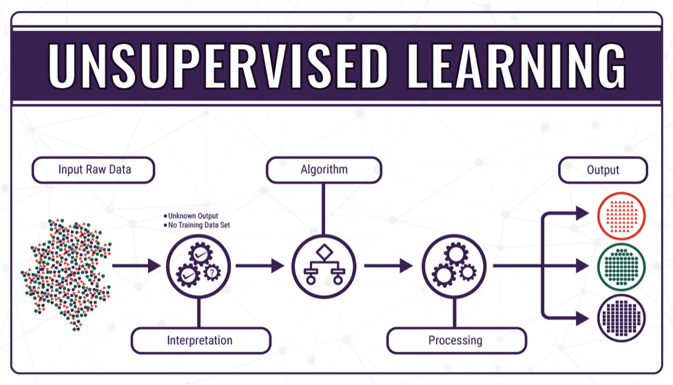

# Machine Learning
 
 This section will introduce you to the three main categories of machine learning algorithms. There will be several examples, video explainer alternatives and further learning materials for those wanting a deeper technical understanding linked throughout. 

 This section is focused on gaining a general understanding of how these algorithms work. The first part on supervised learning will be of value for most as these kinds of algorithms are pervasive in all sectors. The Unsupervised and Reinforcement learning sections are much less relevant and included for reference and interest. 

 

## Supervised Learning

Fundamentally Supervised learning is the process of learning how to map inputs to outputs based on a collection of examples.

Inputs and outputs both come from the features of a dataset. We decide on 'output' feature(s) (a.k.a. target variable(s)) and input feature(s) (a.k.a. predictor(s)).​​

The computer uses the predictors to make its best guess of a corresponding target value, then checks its answer with the actual answer (for that instance) and corrects its mechanism for predicting the answer as it goes. ​​

When done well the computer can learn general rules and relationships between the predictors and the targets that enable it accurately make predictions with new unseen data and/or discover important relationships between features.

### Classification & Regression

There are two different forms in which supervised learning takes, classification and regression.​

Classification is used to classify instances into two or more distinct groups. The target outputs would be the correct group label for each instance. e.g., based on a person's medical information would they be classified at low, medium or high risk of coronary heart disease. ​

Regression is concerned with producing a numeric output. Target outputs would be a correct number or measurement. e.g., based on a person’s indirect measurements, what is their current hemoglobin level.​​

To see predictive regression as an interactive example, NZRisk is a model made to estimates post-op mortality risk for patients in NZ based on various attributes, looking at 30 days, 1 and 2 years post-op: [nzRISK Surgical Mortality Model](https://algorithmhub.co.nz/algorithms/nzrisk)

### Inference and Prediction

Generally, there are two main intentions or goals behind developing a supervised learning model that can affect what techniques are used and other considerations or requirements for the model to meet.​

Inference is about gaining insight and understanding about the predictor's relationship and influence over the target variable(s). This is dependent on the model being interpretable.​

Model interpretability is the degree to which a human can discern how a model arrived at a given output. Different ML techniques have varying degrees of interpretability, from white box model such as linear regression where you know exactly how it produced an answer, to black box models where it is nearly impossible to determine the means such as neural networks. It is a very active area of research and development to create techniques to help solve the interpretability problem and there are several toolkits available for certain models that helps address this to a degree (e.g., SHAP and LIME for gradient boosted trees).​

Prediction focuses on how reliably and accurately a model can classify entities or make estimations. In this context, model interpretability often takes a back seat, and we prioritize techniques that offer the best predictive performance. Essentially, we're most concerned with how good the predictions are, rather than understanding the exact pathway a model takes to arrive at them. While having both high accuracy and interpretability is always preferable, achieving this balance is not always possible.

### Supervised Learning Examples

Regression Examples:

The 'hello world' of machine learning - 
[Linear Regression](https://www.youtube.com/watch?v=nk2CQITm_eo)

A more useful technique when we want to account for multiple variables - [Multiple Regression](https://www.youtube.com/watch?v=EkAQAi3a4js) 

Classification Examples:

Yes the name is a bit confusing - [Logistic Regression](https://www.youtube.com/watch?v=yIYKR4sgzI8)

Classic example of an easily explainable algorithm - [Decision Trees](https://www.youtube.com/watch?v=_L39rN6gz7Y)

## Unsupervised Learning

Unsupervised learning deals with data that only consists of inputs without any pre-assigned labels or target values. Unlike supervised learning, where models learn from labeled examples, unsupervised learning involves discovering the underlying structure or patterns within the data on its own. ​​

This type of learning does not involve direct instruction but rather enables the model to identify relationships and patterns through exploration. ​

Common techniques in unsupervised learning are clustering, dimensionality reduction and association rule learning.

### Clustering

Clustering (Cluster Analysis) is used to discover groupings of data, by asking the computer to cluster data into x-clusters or dynamically discover the number of clusters itself. ​    ​

There are four main types of clustering:​

    ​
* Connectivity (Hierarchical) clustering, groups data by creating a dendrogram, a tree-like structure, based on the proximity of data points, using distance measures such as Euclidean or Manhattan distance. This method can be divisive, starting with all data in one cluster and dividing it into smaller clusters, or agglomerative, where each data point starts in its own cluster and is progressively merged into larger clusters. The result is a hierarchy of clusters that can be divided at different levels to obtain a granular or broad grouping.​

* Centroid (Partition) clustering, such as K-Means, assigns data points to clusters based on their closeness to the center (centroid) of the cluster. This method requires pre-defining the number of clusters and iteratively adjusts the centroids and cluster assignments to minimize variance within each cluster.
* Density clustering, focuses on areas of high data point concentration to form clusters, separated by areas of low density. It's capable of identifying clusters of arbitrary shapes, is effective at handling noise and outliers. The core concept is that each point in a cluster must have x number of fellow cluster members within y radius of itself.
* Distribution clustering, groups data points based on the likelihood of belonging to the same statistical distribution, such as Gaussian or Binomial. This approach assumes the data points in a cluster follow the same distribution, with each cluster characterized by parameters of that distribution. It's flexible in the shapes and sizes of clusters it can detect when its assumptions are met.

### Clustering Examples

The 'hello world' of clustering, a centroid example  - [K-Means](https://www.youtube.com/watch?v=4b5d3muPQmA)

One of the most effective and popular clustering methods, a density example - [DBSCAN](https://www.youtube.com/watch?v=RDZUdRSDOok)

The odd one out of these techniques - [hierarchical Cluster](https://www.youtube.com/watch?v=7xHsRkOdVwo)

A Distribution example, can be very mathy - [Gaussian Mixture Models](https://www.youtube.com/watch?v=DODphRRL79c)

### Dimensionality Reduction

Dimensionality reduction techniques enable us to systemically reduce the number of features under consideration, by pruning the less informative dimensions or combining them into more meaningful ones.  This can help mitigate the risk of overfitting, reduce computational load, and make visualization of high-dimension data possible. ​

There are two main categories of Dimensionality reduction:​​

* Feature Selection: Selects the most informative and significant features from the original dataset. Feature selection methods include filter methods, wrapper methods, and embedded methods, each differing in how they assess the importance of the features, but all aiming to retain only those that contribute most to the predictive power of the model. *Most are not unsupervised learning.​

* Feature Extraction: Involves creating new features by combining or transforming the original features. The goal is to create a set of features that captures the essence of the original data in a lower-dimensional space. *Most of these are unsupervised learning.

### Dimensionality Reduction Examples

The most commonly used reduction technique - [Principal Component Analysis (PCA)](https://www.youtube.com/watch?v=FgakZw6K1QQ)

Also very popular, this is actually supervised learning, but is often compared with PCA - [Linear Discriminate Analysis (LDA)](https://www.youtube.com/watch?v=azXCzI57Yfc)

### Association Rule Learning 

Also known as Association Rule Mining, is used to identify relationships, patterns and associations in datasets. This technique is commonly used for market basket analysis to better understand the relationship between different products. E.g., a store wants to find out the relationship between the sale of one product in relation to another, based on customer behavior. Like if a customer buys milk, then they may also buy bread, eggs, or butter.  

An example of this used for market basket analysis - [Apriori Algorithm](https://www.youtube.com/watch?v=guVvtZ7ZClw) 

### Reinforcement Learning

Reinforcement learning is when an autonomous agent learns through trial and error with respect to its environment. Reinforcement learning seeks to maximize long-term reward over shot-term reward. It seeks to balance the discovery of new learning with the exploitation of existing learning. It is primarily geared towards sequential decision-making problems.​​

The learning agent (with respect to a goal) gains information about its state from the surrounding environment. It uses this to determine the best action to take. After taking an action if there is either a reward or punishment signal from the environment it incorporates this into its understanding by either suppressing or encouraging that behavior in future.​​

For the learning agent to discover optimum strategies need to experiment and try new behaviors. Through reward and punishment, it learns and retains new means of accomplishing a goal. It needs to still leverage known positive behaviors as the agent prioritizes achieving the largest cumulative reward. LLM's like ChatGPT have used human feedback as a form of reinforcement learning to fine tune models.

A video break-down, a bit easier with a animated example: [Reinforcement Learning](https://www.youtube.com/watch?v=nIgIv4IfJ6s)

