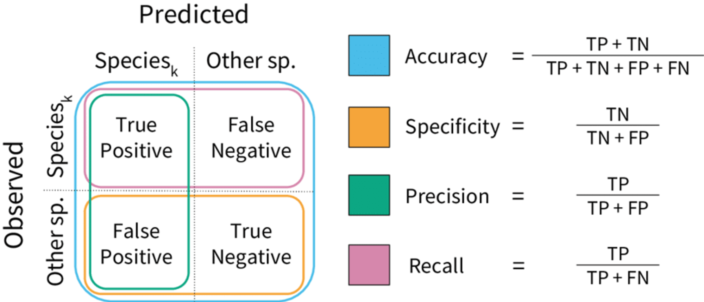
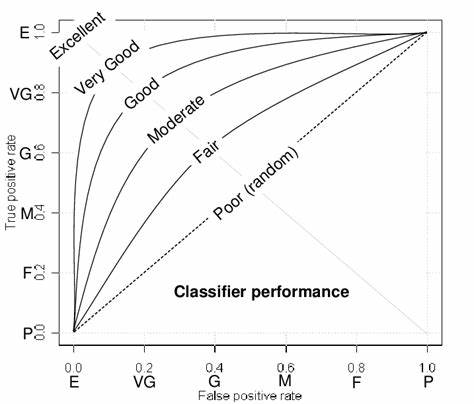

# Model Metrics

Model metrics are an extremely important and useful tool when it comes measuring machine learning and AI models. These metrics give us a variety of methods to quantify various aspects of model performance in specific tasks. They enable us to make meaningful comparisons between different types of models so that we can pick the best solution for the job. 

In this section we will cover some of the most common performance metrics used in supervised learning for regression and classification tasks. This is by no means exhaustive, but is a solid base of understanding, which should be enough to start reading academic papers that focus on testing the performance of ML/AI models.

## Regression Metrics

Regression seeks to gain an optimal result by minimizing an error term. Regression makes its prediction for each instance in a dataset and then compares this to the actual value (target output). The difference between these numbers is the random error for this instance. Regression takes the sum of all errors to quantify how accurate it was across the whole dataset (the smaller the better).

​
A quick definition to know - 'absolute value' is the positive representation of any number (unsigned). This enables negative and positive numbers to be added together without them canceling out so you can preserve the overall size of an effect.

### Mean Absolute Error (MAE)

Measures the average magnitude of prediction errors and is expressed in the same units as the target variable (e.g., mmHg for blood pressure, mg/dL for blood glucose). MAE is less sensitive to outliers compared to other metrics and its interpretability makes it a valuable tool for assessing model performance.​

### Mean Squared Error (MSE)

Measures the average squared difference between predicted and actual values. This gives more weight to larger errors to have a disproportionate effect on this metric. If you optimized for MSE, your model would be particularly sensitive to larger errors, as they are weighted more heavily. 

### Root Mean Squared Error (RMSE)

The square-root of the MSE, this converts the MSE back to the units of the target variable making it easier to interpret. While RMSE, similar to MSE, it is sensitive to outliers, but is a balance between MSE and MAE.

### Mean Absolute Percentage Error (MAPE)

This metric takes each error as a percentage of the observed value. Then it takes the absolute mean of these percentages. This metric's main advantage is being scale agnostic (the units of measurement have no effect on it). This allows comparison of model performance across different datasets and ease of interoperability by stakeholders. To note, it can be undefined or disproportionately high when the actual values are close to zero.

### R-Squared 

Is a metric used to describe how much of the variance in the target variable is explained by the predictors. It's a value between 0 - 1, where 1 means a perfect  fit, which should always suspicious indicator of overfitting, there is no such thing as a perfect model. We can calculate R-Squared by the following steps:

* Total Sum of Squares (TSS): We take the sum, of the square, of each observed value minus its mean. This captures the total variation in the target variable relative to its mean.

* Residual Sum of Squares (RSS): Nearly the same calculation as TSS but instead, we minus the predicted and observed values from each other. This measures the variation in the target that the model didn't capture.

R-Squared = (TSS-RSS) / TSS

TSS - RSS captures how much variation in the target our model did capture. Then dividing it by TSS converts that to a proportion of total variance (0 - 1) making it agnostic to the units of measurement.
​
### Adjusted R-Squared

R-Squared does not consider the number of predictors in a model; it only measures the variance explained in the target. Adjusted R-Squared corrects for this by adjusting the R-Squared value based on the number of predictors and the sample size.​

It penalizes the addition of predictors that do not improve the model’s explanatory power. If an added predictor does not increase the explained variance, Adjusted R-Squared will decrease, potentially indicating overfitting. This makes Adjusted R-Squared a more reliable metric for comparing models with different numbers of predictors.​​

It is nearly always preferable to choose the simpler model with fewer predictors if it explains a comparable amount of variance in the target variable as another model with more predictors. This practice helps to reduce the risk of overfitting, lowers computational complexity, and potentially reduces the model's reliance on variables that do not significantly contribute to explaining the variance in the target variable.

## Classification Metrics

Classification is a type of predictive modeling that aims to assign a label or category to each instance in a dataset. It seeks to determine the most likely class for each instance by analyzing the input features. The performance of a classification model is evaluated by comparing the predicted labels to the actual labels in the dataset.

### Four Types of Predictions

These are the four types of prediction a classification model can produce:

True Positives (TP) - When the model and reality agree on a positive case.​​

True Negatives (TN) - When the model and reality agree on a negative case.​​

False Positives (FP) - When the model thinks an instance is a positive case, but it's actually negative (Type I error). ​​

False Negatives (FN) - When the model thinks an instance is a negative case, but it's actually positive (Type II error).

The below image is a Confusion Matrix - its is a summary table commonly used to display these four measures in a friendly and convenient way ():

### Accuracy

Accuracy = (TP + TN) / (TP + TN + FP + FN) 

Accuracy is a simple measure that states the proportion of total cases that were correctly classified by the model.​

The inverse of accuracy (1 - accuracy) is called the 'classification error rate'

### Specificity (True Negative Rate)

Specificity = TN / (TN + FP)

Specificity refers to the proportion of individuals without a disease who are correctly identified as negative by a test. This metric is essential when minimizing false positive results is crucial, such as in screening programs where unnecessary follow-up tests or treatments resulting from false alarms can be burdensome and cause undue anxiety for patients.

### Sensitivity (Recall, True Positive Rate)

Sensitivity = TP / (TP + FN)

Sensitivity measures the proportion of individuals with a disease who are correctly identified as positive by a test. For instance, if a test has a sensitivity of 0.7 and there are 100 patients with the disease, the test would accurately diagnose 70 of them. High sensitivity is crucial when failing to diagnose a patient with the disease (a false negative) carries severe consequences, even if it means accepting a higher rate of false positives.​

### Precision

Precision = TP / (TP + FP) 

Precision refers to the proportion of positive test results that truly represent the presence of the disease. For example, if a test has a precision of 0.85, it means that 85% of patients who test positive actually have the disease. Tests with high precision are crucial when the consequences of a false positive, such as unnecessary treatment or patient anxiety, are significant.​

### Sensitivity v Specificity & Precision Trade off 

There's often a trade-off between sensitivity (the ability to correctly identify true positives, such as diseased patients) and both precision (the ability to avoid false positives, such as misdiagnosing healthy individuals) and sensitivity (the ability to identify healthy individuals).

When optimizing for higher sensitivity in a model, often leads to decreases in precision and specificity where as the inverse is commonly true when optimizing for precision or specificity.

This balance is especially crucial when dealing with conditions that are rare or have a high cost associated with misdiagnosis. Adjusting diagnostic thresholds or using a two-step approach with different tests can help optimize this balance based on the specific clinical context and the potential consequences of false results. The choice of diagnostic tools and strategies should carefully consider factors such as invasiveness, cost, and the potential impact on patient care.

### F1 Score

F1 = 2× ( (Precision * Sensitivity) / (Precision + Sensitivity) )

F1 score is a metric that tries to provide a balanced measure of both recall and precision by using their harmonic mean. Where accuracy is agnostic to class imbalance F1 score is not. Where there is a notable class imbalance this can substantially influence the F1 score, often making it a much more informative metric compared to accuracy. F1 score also does not take true negatives into account which can be important when most cases are negative ones.​

### Receiver Operating Characteristic (ROC) Curve

A graphical representation of a model's ability to distinguish between positive and negative classes. It plots Sensitivity (True Positive Rate) against the False Positive Rate (1 - Specificity).

### Area Under the ROC Curve (AUC-ROC)

AUC-ROC numerically quantifies what is visually represented by the ROC curve. It takes the area under that curve and ranges from 0 - 1 where 1 is a perfect model. It is important to note that a AUC-ROC of 0.5, is equivalent to picking at random. A score below 0.5 would indicate a model performing worse than picking at random.