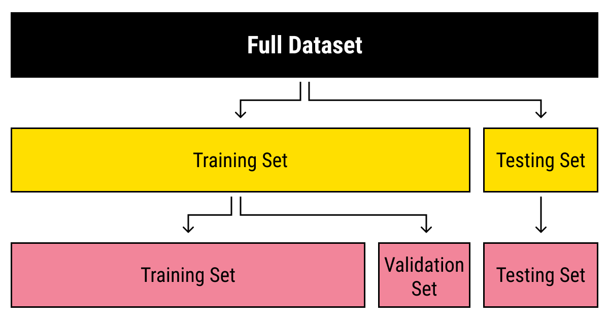
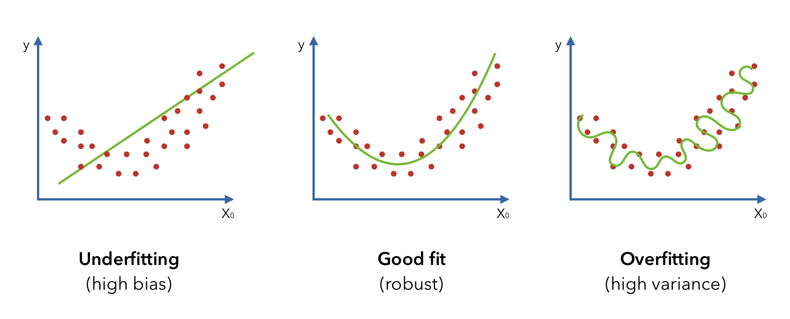

# Modelling

This section is an overview of some of the considerations taken when training AI/ML models. 
From how data is formatted, scaled and split to ensure we can create the most relevant and valid models possible.

## Representing the World in Data

To create computer models to help understand and make predictions of our physical world we need digital representations of it. Data, usually stored in the form of tables/dataframes,  making this information manageable, understandable and digestible for computer models.​​

Each row of a table corresponds to one 'instance', a single entity that we are describing with data. If we are predicting house prices each row would be one house, or understanding causes of stroke each row would represent a person.​​

The columns of a table are called 'features', each one a characteristic that describes something about the instances we analyzing. Features are usually but not always, either a number (number of rooms, total area, age, height, weight) or categorical (has central heating (y/n), internet type (dial-up, broadband, fiber, none), ethnicity, sex).
 

## Data Preparation

Data seldom comes ready-to-use for computer models. It often requires uniform formatting across all features, we must address instances with missing information and determine if outliers (extreme values that stand out from the rest of the data) are retained or disposed of. For many models, categorical data must be encoded in numeric form, with techniques such as one-hot encoding.​​

Another key issue is how the scale of numeric data can create biases. For instance, measuring length in millimeters results in larger numbers than if measured in centimeters, potentially leading models to overemphasize these features due to their larger numerical values. To prevent this, we scale data using techniques such as normalization, where all measurements are adjusted to fit between 0 and 1. This levels the playing field among different scales but can be thrown off by 'outliers,' which can stretch or compress the range in a way that doesn't reflect most of the data.​​

Standardization is another method that's particularly handy when we need to maintain the natural spread of data, outliers included. It doesn't squash the data into a fixed range but repositions it so that the average value sits at zero, and we measure everything else by how much it differs from this average. Imagine grading on a curve: a score isn't just a number but tells you how it compares to the group average. This approach is less affected by outliers and helps in understanding the data's context and variability. So, what to use? It depends! Normalization is best when you want a neat, uniform scale without extreme values, while standardization is preferable for preserving relationships within the data, including those pesky outliers.

## Feature Vectors, Feature Space & Dimensionality  

Each 'instance' in a dataset is represented by a 'feature vector’, containing all its characteristics. These vectors place each instance within a 'feature space’. Imagine plotting age, height, and weight in a 3-dimensional space where each axis represents one of these features.

However, as we add more features, the space expands beyond three dimensions, complicating visualization and analysis. This expansion can lead to the 'curse of dimensionality,' where too many features can make our data models less effective and harder to manage. ​

You can measure distances in vector space. It enables algorithms to quantify the similarity between data points. For example,  Euclidean distance measures the 'straight-line' distance between two points in this space, which is intuitive in three dimensions but can extend to any number of dimensions. 

## Subsets for Training and Testing

When training models, it's crucial to ensure they learn patterns and rules that apply not just to the data they're trained on but also to new, unseen data. To check for this during development, we use random sampling to split the data into separate sets. For tasks like classification, where the presence of each class might be uneven, 'stratified sampling' ensures that each split maintains the original proportion of classes.​    ​

A common split of data results in three sets:​

* Training Set: Contains most of the data, providing the model with ample information to learn from, including the target values needed for training.​

* Validation Set: After training, the model is tested against this set where we measure its performance. This feedback helps us fine-tune the model through adjustments and retraining until we reach satisfactory performance level.​

* Test Set: Used to evaluate the final version of the model against completely unseen data, offering the best estimate of how it will perform in the real world.

## Overfitting and Underfitting 

In the quest for a model that performs well, we navigate between two common pitfalls: underfitting and overfitting.​​

* Underfitting occurs when a model is too simple to capture the underlying patterns in the training data. This usually means it won't perform well on the training set nor on new data, essentially failing to learn the crucial insights from the data it was provided.​

* Overfitting is the opposite problem. Here, the model becomes so attuned to the training data that it learns its details and noise as if they were significant patterns. As a result, while it may perform exceptionally well on the training set, its performance drops significantly on new, unseen data because it has essentially memorized the training set, not learned generalizable patterns.    ​

There is also the issue of indirect overfitting. If we were to repeatedly adjust our model based on its performance on the test set, we would inadvertently start 'overfitting' to the test set. This would compromise the test set's role as an unbiased evaluator of the model's ability to generalize. Therefore, the validation set acts as a safeguard, providing a separate dataset for tweaking and improving the model.

## K-fold Cross Validation

K-fold cross-validation serves as an alternative to using fixed training and validation sets by partitioning the dataset into 'k' equal parts, or folds.​

In each iteration, one-fold is used as the validation set while the remaining folds collectively form the training set. This process repeats 'k' times, with each fold serving as the validation set exactly once.​

This technique ensures that all data is used for both training and validation, enhancing the model's learning and validation phases. However, it's important to maintain a separate test set, not involved in the cross-validation process.

## An implementation resource for AI/ML and Data Science in health:

Please make use of this excellent Te Whatu Ora resource focused on how to successfully implement some of the technology mentioned here in a health context - [Health Data Science in Aotearoa New Zealand: A Practical Guide](https://tewhatuora.github.io/data-science-guide/)