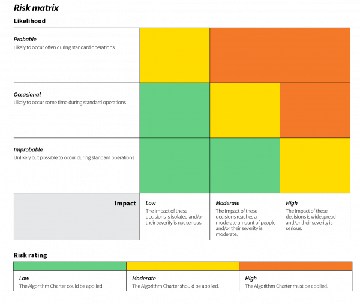
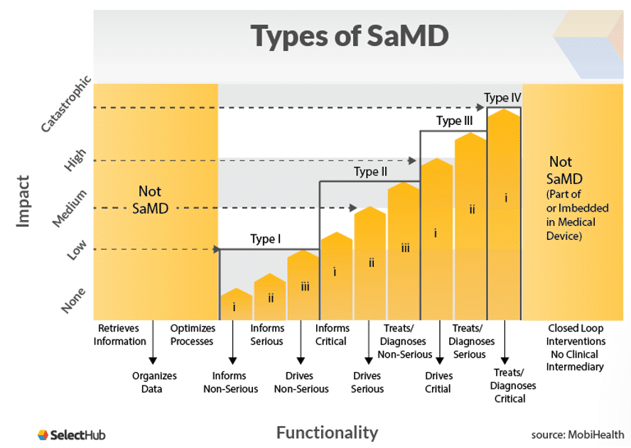

# Risk Management

## Managing and Quantifying Risks in AI

The advent of AI in healthcare brings considerable benefits but also complex challenges that demand systematic risk management. There is a pressing need for robust frameworks to quantify and mitigate the inherent risks associated with AI deployment.

Issues such as data bias must be preemptively addressed to ensure equitable outcomes. Privacy concerns and ethical considerations also require commitment to safeguard sensitive health information. By emphasizing the crucial elements of transparency, ethics, and oversight, such frameworks serve to guide healthcare entities in effectively managing risks.

This ensures that the integration of AI into healthcare not only improves care but also maintains the trust and autonomy of patients, ultimately leading to safer outcomes and sustained public confidence in the use of AI technology in health.

## Quantifying Risk – Algorithm Charter for NZ

The Algorithm Charter for New Zealand provides a structured approach to quantifying AI/algorithm risk in the public sector by employing a risk matrix that assesses the likelihood of unintended consequences against their impact. This framework guides government agencies in applying AI thoughtfully, with focus a on potentially high associated risk for the public.

By committing to transparency, safeguarding privacy, ethics, and human rights, and ensuring human oversight, the Charter can help healthcare agencies manage the use of AI, responsibly and ethically. This approach supports better decision-making, enhance public trust in how health-related data and AI is utilized, specifically addressing critical areas such as bias management and the protection of sensitive health information.

[Algorithm charter for Aotearoa New Zealand](https://data.govt.nz/toolkit/data-ethics/government-algorithm-transparency-and-accountability/algorithm-charter/)

## FDA - Software as a Medical Device (SaMD)​

The IMDRF's framework for SaMD provides an approach for categorizing and managing the risks associated with AI-driven medical software. By establishing a clear categorization based on the significance of the information provided by the SaMD and the healthcare context—ranging from non-serious to critical—this framework aids in identifying appropriate risk management strategies. ​

It promotes AI in healthcare that is developed, deployed, and maintained with a strong emphasis on safety, efficacy, and security, addressing specific risks associated with the ‘socio-technical  environment’, system dependencies, and information security.

[Software as a Medical Device](https://www.fda.gov/medical-devices/digital-health-center-excellence/software-medical-device-samd)

